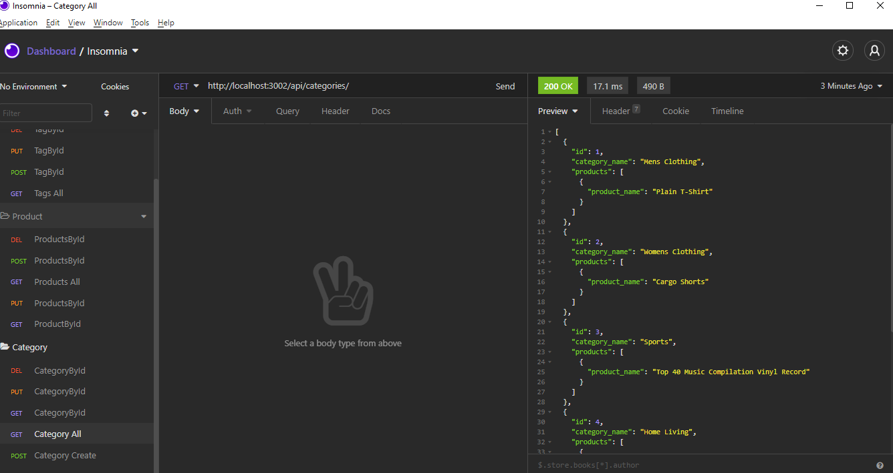

## Description

This application is the back-end of an e-commerce site and can be connected to a frontend UI application. It leverages express.js api and sequelize to communicate with Mysql db. We are using the ORM mappings, models and associations to get the functionality.


### _Demo_

https://drive.google.com/file/d/1wdjf7cTxp2MdsHAflbv3nk-v-aKyBBPg/view

The screenshots and videos below show this application previews:




### _Installation_

1. Download or clone repository.
2. [**Node.js**](https://nodejs.org/en/about/) and [**MySQL Workbench**](https://dev.mysql.com/doc/workbench/en/) are required to run the application.
3. Run `npm install` in the Terminal to install the required npm packages
4. In the root of the application, create `.env` file and enter the following details for your MySQL:

   `DB_NAME=ecommerce_db`

   `DB_USER=`**your username**

   `DB_PASSWORD=`**your password**

5. Open up MySQL shell and input:

   `source db/schema.sql`

6. Run the following in the Terminal to seed test data:

   `npm run seed`

### _Usage_

- To start using the application, input the following in your Terminal

  `npm start`

  or

  `node server.js`

- Open up [**Postman**](https://www.postman.com/) or [**Insomnia**](https://insomnia.rest/) to GET, POST, PUT and DELETE from different routes

- Or navigate to `http://localhost:3002/` in your browser

## User Story

```md
AS A manager at an internet retail company
I WANT a back end for my e-commerce website that uses the latest technologies
SO THAT my company can compete with other e-commerce companies
```

## Acceptance Criteria

```md
GIVEN a functional Express.js API
WHEN I add my database name, MySQL username, and MySQL password to an environment variable file
THEN I am able to connect to a database using Sequelize
WHEN I enter schema and seed commands
THEN a development database is created and is seeded with test data
WHEN I enter the command to invoke the application
THEN my server is started and the Sequelize models are synced to the MySQL database
WHEN I open API GET routes in Insomnia Core for categories, products, or tags
THEN the data for each of these routes is displayed in a formatted JSON
WHEN I test API POST, PUT, and DELETE routes in Insomnia Core
THEN I am able to successfully create, update, and delete data in my database
```
# Contribution
  Pull requests are always welcome

# Questions
 For any questions on this repo please feel free to raise an issue.    

